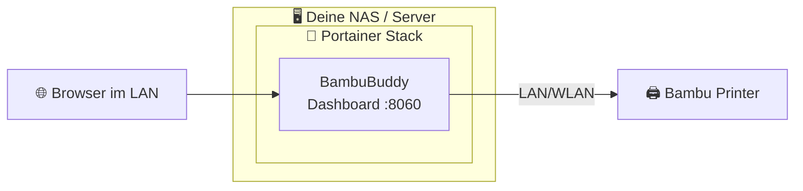

# 🖨️ hAI.BambuPortainer

[](https://www.buymeacoffee.com/highfish)

[](https://github.com/jbkunama1/hAI.BambuPortainer/stargazers)
[](https://github.com/jbkunama1/hAI.BambuPortainer/network/members)
[](https://github.com/jbkunama1/hAI.BambuPortainer/issues)
[](LICENSE)
[](docker-compose.yml)
[](https://jbkunama1.github.io/hAI.BambuPortainer/)
[](https://github.com/maziggy/bambuddy)

> **Portainer Stack** für deinen Bambu 3D-Drucker! 🖨️ **Ein Container, ein Port.** [BambuBuddy](https://github.com/maziggy/bambuddy) als Dashboard – G-Code hochladen und fertige Drucke direkt an den Drucker senden. Deployed direkt aus GitHub in Portainer – kein manuelles Clonen nötig.

---

## 🧩 Was ist das?

Dieses Repo liefert **einen einzigen Portainer Stack** – nur **BambuBuddy**. Du slicst woanders (Bambu Studio Desktop, OrcaSlicer, …) und sendest die fertigen G-Code-Dateien über das Dashboard an deinen Drucker.

| Container | Zweck | Image-Quelle |
|---|---|---|
| 📊 **BambuBuddy** | Dashboard: Drucker-Monitoring, G-Code hochladen & an Drucker senden | Upstream-Image `ghcr.io/maziggy/bambuddy` |

---

## 📊 Architektur



---

## 🚀 Portainer Deploy

BambuBuddy wird direkt vom Upstream `ghcr.io/maziggy/bambuddy` bezogen – kein Image-Build nötig.

### Voraussetzungen
- Portainer Business oder CE ≥ 2.x
- Zugriff auf das Internet vom Docker-Host aus

### Schritte

1. In Portainer → **Stacks** → **+ Add stack**
2. Name: z. B. `bambubuddy`
3. Build method: **Repository**
4. Repository URL: `https://github.com/jbkunama1/hAI.BambuPortainer`
5. Repository reference: `refs/heads/main`
6. Compose path: `docker-compose.yml`
7. **Deploy the stack** – Portainer pullt das Image von GHCR (`pull_policy: always`), kein Build auf dem Host. Das Netzwerk wird automatisch mit angelegt.

Danach im BambuBuddy-Dashboard unter **Settings** deinen Drucker (IP + Access Code) hinterlegen.

Zugriff: `http://<host>:8060`

---

## 🔧 Environment Variables

| Variable | Beschreibung | Beispiel |
|---|---|---|
| `BAMBU_BUDDY_PORT` | Externer Port (Container-Port ist 8109) | `8060` |
| `PUID` | Benutzer-ID (Standard 1000) | `1000` |
| `PGID` | Gruppen-ID (Standard 1000) | `1000` |
| `TZ` | Zeitzone | `Europe/Berlin` |

Falls du eine `.env`-Datei nutzen möchtest: Kopiere `.env.example` und fülle die Werte aus.

---

## 📂 Dateistruktur

```
hAI.BambuPortainer/
├── docker-compose.yml              ← Ein Portainer-Stack (nur BambuBuddy)
├── .env.example                    ← Vorlage für Umgebungsvariablen
├── .github/workflows/
│   ├── trufflehog.yml              ← täglicher Secret-Scan
│   └── gh-pages.yml                ← deployt index.html auf GitHub Pages
├── index.html                      ← Landingpage (GitHub Pages)
└── README.md
```

---

## ℹ️ Hinweise & Limits

- Für die Printer-Konnektivität muss dein NAS den Drucker im **lokalen Netzwerk** erreichen (Bambu Cloud optional).
- Ein Update holst du dir einfach per **Stack → Duplicate/Edit → Redeploy** (neues `latest`).
- Das Slicen selbst passiert außerhalb (Desktop-Slicer) – dieses Setup sendet **fertige G-Code-Dateien** an den Drucker.

---

## 📝 Upstream

| Container | Upstream | Lizenz |
|---|---|---|
| BambuBuddy | [maziggy/bambuddy](https://github.com/maziggy/bambuddy) | [AGPL-3.0](https://github.com/maziggy/bambuddy/blob/main/LICENSE) |

---

## 📄 Lizenz

Dieses Repo: **GPL-3.0** – siehe [LICENSE](LICENSE). Upstream-Projekte behalten ihre jeweilige Lizenz.