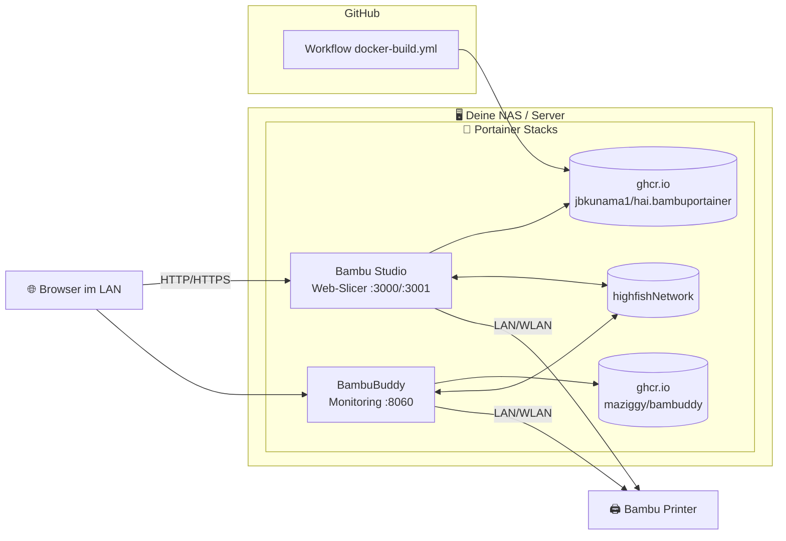

# 🖨️ hAI.BambuPortainer

[](https://www.buymeacoffee.com/highfish)

[](https://github.com/jbkunama1/hAI.BambuPortainer/stargazers)
[](https://github.com/jbkunama1/hAI.BambuPortainer/network/members)
[](https://github.com/jbkunama1/hAI.BambuPortainer/issues)
[](LICENSE)
[](docker-compose.bambustudio.yml)
[](https://jbkunama1.github.io/hAI.BambuPortainer/)
[](https://github.com/jbkunama1/hAI.BambuPortainer/pkgs/container/hai.bambuportainer)
[](https://github.com/linuxserver/docker-bambustudio)
[](https://github.com/maziggy/bambuddy)

> **Portainer Stacks** für deinen 3D-Drucker! 🖨️ Von deiner **NAS** aus: [Bambu Studio](https://github.com/linuxserver/docker-bambustudio) als Web-Slicer im Browser + [BambuBuddy](https://github.com/maziggy/bambuddy) als Drucker-Monitoring/Dashboard. Beide Container laufen im `highfishNetwork`, deployt direkt aus GitHub in Portainer – kein manuelles Clonen nötig.

---

## 🧩 Was ist das?

Dieses Repo liefert fertige **Portainer Stacks** (Git-Deployment) für deine Bambu-3D-Drucker-Infrastruktur:

| Container | Zweck | Image-Quelle |
|---|---|---|
| 🎛️ **Bambu Studio** | Slicing-Software als **Web-App** im Browser (kein Client-Install nötig) | eigenes GHCR-Image `ghcr.io/jbkunama1/hai.bambuportainer` |
| 📊 **BambuBuddy** | Monitoring & Dashboard für deinen Bambu-Drucker | Upstream-Image `ghcr.io/maziggy/bambuddy` („nimm das alles so") |

Ein GitHub Actions Workflow baut das Bambu-Studio-**Wrapper-Image** bei jedem Push auf `main` aus dem [LinuxServer.io-Base](https://github.com/linuxserver/docker-bambustudio) und pusht es auf `ghcr.io/jbkunama1/hai.bambuportainer` – Portainer holt nur noch das fertige Image. BambuBuddy wird direkt vom Upstream bezogen.

---

## 📊 Architektur



---

## 🚀 Portainer Deploy

Das Bambu-Studio-Image wird von GitHub Actions gebaut (`.github/workflows/docker-build.yml`, bei jedem Push/Commit) und auf `ghcr.io/jbkunama1/hai.bambuportainer` gepusht. BambuBuddy wird direkt vom Upstream `ghcr.io/maziggy/bambuddy` bezogen.

**Manuell anstoßen:** GitHub → Repo → **Actions** → **Build & Push Docker Image to GHCR** → **Run workflow**.

### Voraussetzungen
- Portainer Business oder CE ≥ 2.x
- Zugriff auf das Internet vom Docker-Host aus
- Docker-Netzwerk **`highfishNetwork`** anlegen (einmalig): Portainer → **Networks** → **Add network** → Name `highfishNetwork` → Driver `bridge`
- **Einmalig:** GHCR-Paket `hai.bambuportainer` als **public** setzen (GitHub → Repo → **Packages** → `hai.bambuportainer` → **Package settings** → **Change visibility** → Public), sonst braucht Portainer Login-Credentials.

### Schritte: Bambu Studio (Web-Slicer)

1. In Portainer → **Stacks** → **+ Add stack**
2. Name: `bambustudio`
3. Build method: **Repository**
4. Repository URL: `https://github.com/jbkunama1/hAI.BambuPortainer`
5. Repository reference: `refs/heads/main`
6. Compose path: `docker-compose.bambustudio.yml`
7. **Environment variables** setzen (siehe unten)
8. **Deploy the stack** – Portainer pullt das vorgebaute Image (`pull_policy: always`), kein Build auf dem Host.

### Schritte: BambuBuddy (Monitoring)

1. In Portainer → **Stacks** → **+ Add stack**
2. Name: `bambuddy`
3. Build method: **Repository**
4. Repository URL: `https://github.com/jbkunama1/hAI.BambuPortainer`
5. Repository reference: `refs/heads/main`
6. Compose path: `docker-compose.bambuddy.yml`
7. **Deploy the stack**
8. Danach im BambuBuddy-Dashboard unter **Settings** deinen Drucker (IP + Access Code) hinterlegen.

---

## 🔧 Environment Variables

### Bambu Studio

| Variable | Beschreibung | Beispiel |
|---|---|---|
| `BAMBU_HTTP_PORT` | Externer Port (HTTP) für das Web-Interface | `3000` |
| `BAMBU_HTTPS_PORT` | Externer Port (HTTPS) für das Web-Interface | `3001` |
| `BAMBU_WS_PORT` | Externer Port für den WebSocket | `8082` |
| `PUID` | Benutzer-ID (Standard 1000) | `1000` |
| `PGID` | Gruppen-ID (Standard 1000) | `1000` |
| `TZ` | Zeitzone | `Europe/Berlin` |
| `DARK_MODE` | Dark Mode aktivieren (`true`/`false`) | `true` |
| `CUSTOM_USER` | Basic-Auth-Benutzername (**ändern!**) | `abc` |
| `CUSTOM_PASSWORD` | Basic-Auth-Passwort (**unbedingt ändern!**) | `abc` |

### BambuBuddy

| Variable | Beschreibung | Beispiel |
|---|---|---|
| `BAMBU_BUDDY_PORT` | Externer Port für das BambuBuddy Web-UI (Container-Port ist 8109) | `8060` |
| `PUID` | Benutzer-ID | `1000` |
| `PGID` | Gruppen-ID | `1000` |
| `TZ` | Zeitzone | `Europe/Berlin` |

Falls du eine `.env`-Datei nutzen möchtest: Kopiere `.env.example` und fülle die Werte aus.

> ⚠️ **Sicherheit:** Die Defaults `abc`/`abc` für Basic Auth sind nur zum Start gedacht – **ändere unbedingt** `CUSTOM_USER` und `CUSTOM_PASSWORD`, bevor du den Container aus dem LAN erreichbar machst!

---

## 📂 Dateistruktur

```
hAI.BambuPortainer/
├── Dockerfile                      ← Wrapper-Image (Bambu Studio, linuxserver-Base)
├── docker-compose.bambustudio.yml  ← Portainer Stack: Bambu Studio (GHCR-Pull)
├── docker-compose.bambuddy.yml     ← Portainer Stack: BambuBuddy (GHCR-Pull)
├── .env.example                    ← Vorlage für Umgebungsvariablen
├── .github/workflows/
│   ├── docker-build.yml            ← baut & pusht Bambu-Studio-Image auf ghcr.io
│   ├── trufflehog.yml              ← täglicher Secret-Scan
│   ├── testdriver.yml              ← CI-Validierung für Pull Requests
│   └── gh-pages.yml                ← deployt index.html auf GitHub Pages
├── index.html                      ← Landingpage (GitHub Pages)
└── README.md
```

---

## ℹ️ Hinweise & Limits

- **Bambu Studio im Container ist nur für x86-64 (amd64) verfügbar** – kein ARM / Raspberry Pi! 🐧
- Das Image basiert auf [LinuxServer.io](https://github.com/linuxserver/docker-bambustudio) und benötigt `--shm-size="1gb"` für stabile Performance (ist in der Compose gesetzt).
- Das Web-Interface braucht einen **modernen Browser** (Chrome/Firefox/Edge).
- Für die Printer-Konnektivität muss dein NAS den Drucker im **lokalen Netzwerk** erreichen (Bambu Cloud optional).
- BambuBuddy ist unabhängig vom GHCR-Workflow – ein Update holst du dir einfach per **Stack → Duplicate/Edit → Redeploy** (neues `latest`).

---

## 📝 Upstream

| Container | Upstream | Lizenz |
|---|---|---|
| Bambu Studio | [linuxserver/docker-bambustudio](https://github.com/linuxserver/docker-bambustudio) | [GPL-3.0](https://github.com/linuxserver/docker-bambustudio/blob/master/LICENSE) |
| BambuBuddy | [maziggy/bambuddy](https://github.com/maziggy/bambuddy) | [AGPL-3.0](https://github.com/maziggy/bambuddy/blob/main/LICENSE) |

Dieses Repo baut das Bambu-Studio-Image als **Wrapper** aus dem LinuxServer-Base und pusht es nach `ghcr.io/jbkunama1/hai.bambuportainer`. BambuBuddy wird direkt als fertiges Upstream-Image verwendet – der Portainer Stack ist eine 1:1-Deployment-Kopie des offiziellen Stacks.

---

## 📄 Lizenz

Dieses Repo: **GPL-3.0** – siehe [LICENSE](LICENSE). Upstream-Projekte behalten ihre jeweilige Lizenz.